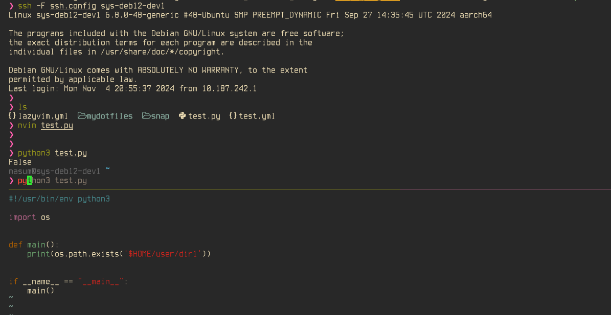

[](https://github.com/astral-sh/ruff)
[](https://github.com/masumndc1/mydotfiles/actions/workflows/ruff-macos.yml)
# mydotfiles
all of my dot files

## custome nvim
I am fan of LazyVim.

## usages
```
ansible-playbook -i inventories/hosts site.yml -l localhost
```

## terminal look

